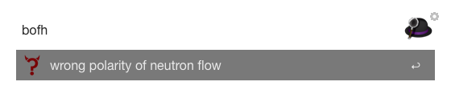

# BOFH Excuses Workflow for Alfred 2 

This workflow returns a BOFH excuse.
Excuse list is ©Jeff Ballard: http://pages.cs.wisc.edu/~ballard/bofh/.

## Install

Download the [workflow](https://github.com/medienlampe/alfred2-bofhexcuses/raw/master/BOFHExcuse.alfredworkflow), then open it to install.

## Usage

Use the keyword 'bofh' to get a random excuse which then can be selected and copied to the clipboard pressing 'Enter'.

## Contributing

1. Fork this repository.
2. Add your feature.
3. Pull requests welcome! :)
